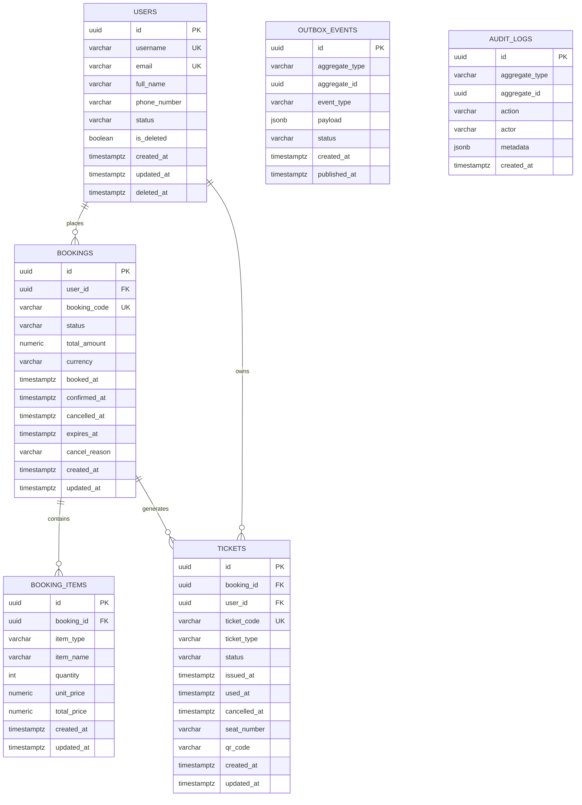

# Database Technical Specification

## 1. Document Overview

### 1.1. Purpose

Tài liệu này mô tả thiết kế cơ sở dữ liệu và các quyết định kỹ thuật cho 3 module nghiệp vụ chính:

- `user`
- `booking`
- `ticket`

Tài liệu tập trung vào:

- Quan hệ dữ liệu giữa các module
- Schema và ràng buộc dữ liệu
- Trạng thái nghiệp vụ
- Chiến lược cache với Redis
- Event-driven integration với RabbitMQ
- Gợi ý tổ chức persistence theo kiến trúc hexagonal

### 1.2. Scope

Phạm vi tài liệu bao gồm:

- Mô hình dữ liệu logic
- Thiết kế bảng quan hệ trong PostgreSQL
- Outbox pattern cho publish event đáng tin cậy
- Mapping giữa chức năng nghiệp vụ và dữ liệu

Không bao gồm:

- Thiết kế UI
- Chi tiết authentication / authorization
- Chi tiết contract payload của toàn bộ API

### 1.3. Audience

Tài liệu này dành cho:

- Backend developers
- Database designers
- Solution architects
- Người review kiến trúc hệ thống

## 2. Table of Contents

- [1. Document Overview](#1-document-overview)
- [2. Table of Contents](#2-table-of-contents)
- [3. Architecture Summary](#3-architecture-summary)
- [4. Business Domain Model](#4-business-domain-model)
- [5. ERD](#5-erd)
- [6. Functional Scope by Module](#6-functional-scope-by-module)
- [7. Database Design](#7-database-design)
- [8. Recommended Indexes](#8-recommended-indexes)
- [9. Business Function to Data Mapping](#9-business-function-to-data-mapping)
- [10. Redis Caching Strategy](#10-redis-caching-strategy)
- [11. RabbitMQ and Outbox Integration](#11-rabbitmq-and-outbox-integration)
- [12. Persistence Package Structure](#12-persistence-package-structure)
- [13. Suggested Domain Entities](#13-suggested-domain-entities)
- [14. Suggested API Surface](#14-suggested-api-surface)
- [15. Migration Strategy](#15-migration-strategy)
- [16. Recommended Baseline](#16-recommended-baseline)

## 3. Architecture Summary

### 3.1. Logical Architecture

Hệ thống được tổ chức thành 3 module nghiệp vụ chính:

- `user`: quản lý người dùng
- `booking`: quản lý giao dịch đặt chỗ
- `ticket`: quản lý vé được phát hành từ booking đã xác nhận

### 3.2. Data Flow Summary

Luồng dữ liệu chính:

1. User tạo booking
2. Booking được lưu với trạng thái ban đầu là `PENDING`
3. Khi booking được xác nhận, hệ thống ghi event vào `outbox_events`
4. Publisher đọc outbox và đẩy event lên RabbitMQ
5. Ticket module consume event `BookingConfirmed`
6. Ticket được phát hành và lưu vào bảng `tickets`

### 3.3. Storage Responsibilities

| Component | Responsibility |
| --- | --- |
| PostgreSQL | Source of truth cho dữ liệu nghiệp vụ |
| Redis | Cache cho các read API |
| RabbitMQ | Truyền domain event bất đồng bộ |
| Outbox table | Đảm bảo event không bị mất khi publish thất bại |

### 3.4. Design Principles

- Dữ liệu nghiệp vụ chính phải nằm trong PostgreSQL
- Cache chỉ tối ưu đọc, không phải nguồn dữ liệu chính
- Event phát sinh từ transaction nghiệp vụ phải được lưu bền vững trước khi publish
- Domain model nên tách biệt khỏi framework và persistence details

## 4. Business Domain Model

### 4.1. Module Responsibilities

#### `user`

Quản lý vòng đời người dùng và trạng thái hoạt động.

#### `booking`

Quản lý yêu cầu đặt chỗ, số tiền, thời hạn xác nhận và trạng thái booking.

#### `ticket`

Quản lý vé được phát hành từ booking đã được xác nhận.

### 4.2. Core Relationships

```text
User 1 --- n Booking
Booking 1 --- n BookingItem
Booking 1 --- n Ticket
User 1 --- n Ticket
```

### 4.3. Business Constraints

- Một `user` có thể có nhiều `booking`
- Một `booking` thuộc đúng một `user`
- Một `booking` có thể có nhiều `booking_item`
- Một `booking` đã xác nhận có thể sinh ra một hoặc nhiều `ticket`
- Một `ticket` phải gắn với đúng một `booking`
- Một `ticket` phải gắn với đúng một `user`

## 5. ERD



## 6. Functional Scope by Module

### 6.1. User Module

- Tạo user
- Lấy user theo ID
- Cập nhật user
- Xóa mềm user
- Khóa user
- Mở khóa user

### 6.2. Booking Module

- Tạo booking
- Xem booking theo ID
- Xem danh sách booking của user
- Xác nhận booking
- Hủy booking
- Xử lý booking hết hạn

### 6.3. Ticket Module

- Phát hành ticket khi booking được xác nhận
- Lấy ticket theo ID
- Lấy danh sách ticket theo booking
- Lấy danh sách ticket theo user
- Đánh dấu ticket đã sử dụng
- Hủy ticket khi booking bị hủy

## 7. Database Design

### 7.1. Table Overview

Các bảng được đề xuất:

- `users`
- `bookings`
- `booking_items`
- `tickets`
- `outbox_events`
- `audit_logs` hoặc `domain_event_logs` là tùy chọn nhưng nên có

### 7.2. Table `users`

```sql
create table users (
    id uuid primary key,
    username varchar(50) not null unique,
    email varchar(100) not null unique,
    full_name varchar(100) not null,
    phone_number varchar(20),
    status varchar(20) not null,
    is_deleted boolean not null default false,
    created_at timestamptz not null,
    updated_at timestamptz not null,
    deleted_at timestamptz
);
```

#### Field Description

| Field | Description |
| --- | --- |
| `id` | Khóa chính |
| `username` | Tên đăng nhập, duy nhất |
| `email` | Email, duy nhất |
| `full_name` | Họ tên hiển thị |
| `phone_number` | Số điện thoại |
| `status` | Giá trị đề xuất: `ACTIVE`, `INACTIVE`, `BLOCKED` |
| `is_deleted` | Cờ xóa mềm |
| `created_at` | Thời điểm tạo bản ghi |
| `updated_at` | Thời điểm cập nhật cuối |
| `deleted_at` | Thời điểm xóa mềm |

### 7.3. Table `bookings`

```sql
create table bookings (
    id uuid primary key,
    user_id uuid not null,
    booking_code varchar(30) not null unique,
    status varchar(20) not null,
    total_amount numeric(12,2) not null,
    currency varchar(10) not null default 'VND',
    booked_at timestamptz not null,
    confirmed_at timestamptz,
    cancelled_at timestamptz,
    expires_at timestamptz,
    cancel_reason varchar(255),
    created_at timestamptz not null,
    updated_at timestamptz not null,
    constraint fk_bookings_user
        foreign key (user_id) references users(id)
);
```

#### Status Values

- `PENDING`
- `CONFIRMED`
- `CANCELLED`
- `EXPIRED`

### 7.4. Table `booking_items`

`booking_items` dùng khi một booking chứa nhiều dòng nghiệp vụ như nhiều loại vé, nhiều ghế hoặc nhiều đơn vị tính phí khác nhau.

```sql
create table booking_items (
    id uuid primary key,
    booking_id uuid not null,
    item_type varchar(30) not null,
    item_name varchar(100) not null,
    quantity int not null,
    unit_price numeric(12,2) not null,
    total_price numeric(12,2) not null,
    created_at timestamptz not null,
    updated_at timestamptz not null,
    constraint fk_booking_items_booking
        foreign key (booking_id) references bookings(id) on delete cascade
);
```

#### Typical Use Cases

- Booking nhiều ghế
- Booking nhiều vé
- Booking nhiều loại ticket

### 7.5. Table `tickets`

```sql
create table tickets (
    id uuid primary key,
    booking_id uuid not null,
    user_id uuid not null,
    ticket_code varchar(30) not null unique,
    ticket_type varchar(30) not null,
    status varchar(20) not null,
    issued_at timestamptz not null,
    used_at timestamptz,
    cancelled_at timestamptz,
    seat_number varchar(20),
    qr_code varchar(255),
    created_at timestamptz not null,
    updated_at timestamptz not null,
    constraint fk_tickets_booking
        foreign key (booking_id) references bookings(id),
    constraint fk_tickets_user
        foreign key (user_id) references users(id)
);
```

#### Status Values

- `ISSUED`
- `USED`
- `CANCELLED`

### 7.6. Table `outbox_events`

`outbox_events` được dùng để triển khai outbox pattern, đảm bảo event được lưu bền vững trước khi publish ra message broker.

```sql
create table outbox_events (
    id uuid primary key,
    aggregate_type varchar(50) not null,
    aggregate_id uuid not null,
    event_type varchar(100) not null,
    payload jsonb not null,
    status varchar(20) not null,
    created_at timestamptz not null,
    published_at timestamptz
);
```

#### Event Types

- `BookingConfirmed`
- `BookingCancelled`
- `TicketIssued`
- `TicketCancelled`

#### Status Values

- `PENDING`
- `PUBLISHED`
- `FAILED`

### 7.7. Table `audit_logs`

`audit_logs` là bảng tùy chọn, nhưng hữu ích nếu cần lưu vết hoạt động nghiệp vụ hoặc vận hành.

```sql
create table audit_logs (
    id uuid primary key,
    aggregate_type varchar(50) not null,
    aggregate_id uuid not null,
    action varchar(50) not null,
    actor varchar(100),
    metadata jsonb,
    created_at timestamptz not null
);
```

#### Typical Audit Use Cases

- Ai tạo user
- Ai xác nhận booking
- Ai sử dụng ticket

## 8. Recommended Indexes

### 8.1. Indexes for `users`

```sql
create index idx_users_email on users(email);
create index idx_users_username on users(username);
create index idx_users_status on users(status);
```

### 8.2. Indexes for `bookings`

```sql
create index idx_bookings_user_id on bookings(user_id);
create index idx_bookings_status on bookings(status);
create index idx_bookings_booking_code on bookings(booking_code);
create index idx_bookings_expires_at on bookings(expires_at);
```

### 8.3. Indexes for `booking_items`

```sql
create index idx_booking_items_booking_id on booking_items(booking_id);
```

### 8.4. Indexes for `tickets`

```sql
create index idx_tickets_booking_id on tickets(booking_id);
create index idx_tickets_user_id on tickets(user_id);
create index idx_tickets_ticket_code on tickets(ticket_code);
create index idx_tickets_status on tickets(status);
```

### 8.5. Indexes for `outbox_events`

```sql
create index idx_outbox_status on outbox_events(status);
create index idx_outbox_aggregate_id on outbox_events(aggregate_id);
create index idx_outbox_event_type on outbox_events(event_type);
```

## 9. Business Function to Data Mapping

### 9.1. User Module

| Function | Data Operation |
| --- | --- |
| Tạo user | `insert` vào `users` |
| Lấy user theo ID | `select * from users where id = ? and is_deleted = false` |
| Cập nhật user | `update users` và evict Redis cache `userById` |
| Xóa mềm user | `update is_deleted = true, deleted_at = now()` |
| Khóa user | `update status = 'BLOCKED'` |

### 9.2. Booking Module

| Function | Data Operation |
| --- | --- |
| Tạo booking | `insert` vào `bookings` và `booking_items`, trạng thái mặc định là `PENDING` |
| Xem booking theo ID | `select` từ `bookings` và `booking_items` |
| Xác nhận booking | `update bookings.status = 'CONFIRMED'`, set `confirmed_at = now()`, ghi `BookingConfirmed` vào `outbox_events` |
| Hủy booking | `update bookings.status = 'CANCELLED'`, set `cancelled_at = now()`, ghi `BookingCancelled` vào `outbox_events` |
| Xử lý hết hạn | Tìm booking `PENDING` có `expires_at < now()` và cập nhật thành `EXPIRED` |

Query mẫu cho job hết hạn:

```sql
select *
from bookings
where status = 'PENDING'
  and expires_at < now();
```

### 9.3. Ticket Module

| Function | Data Operation |
| --- | --- |
| Phát hành ticket | Consume event `BookingConfirmed`, đọc dữ liệu booking, tạo bản ghi trong `tickets`, ghi `TicketIssued` vào `outbox_events` |
| Lấy ticket theo ID | `select * from tickets where id = ?` |
| Lấy ticket theo booking | `select * from tickets where booking_id = ?` |
| Đánh dấu ticket đã dùng | `update status = 'USED', used_at = now()` |
| Hủy ticket | `update status = 'CANCELLED', cancelled_at = now()` |

## 10. Redis Caching Strategy

### 10.1. Recommended Cache Keys

| Module | Key Pattern | Cache Name |
| --- | --- | --- |
| User | `user:{id}` | `userById` |
| Booking | `booking:{id}` | `bookingById` |
| Ticket | `ticket:{id}` | `ticketById` |

### 10.2. Cache Rules

- Các API đọc theo ID có thể cache
- Các luồng thay đổi dữ liệu phải evict cache liên quan
- Không dùng Redis làm nguồn dữ liệu chính

### 10.3. Typical Usage

- `getUserById()` -> `@Cacheable`
- `updateUser()` -> `@CacheEvict`
- `confirmBooking()` -> evict `bookingById`
- `useTicket()` -> evict `ticketById`

## 11. RabbitMQ and Outbox Integration

### 11.1. Booking Confirmation Flow

1. Booking module cập nhật trạng thái booking sang `CONFIRMED`
2. Trong cùng transaction, ghi event `BookingConfirmed` vào `outbox_events`
3. Outbox publisher đọc các event `PENDING`
4. Event được publish lên RabbitMQ
5. Nếu publish thành công, outbox status được cập nhật thành `PUBLISHED`
6. Ticket module consume event và phát hành ticket

### 11.2. Booking Cancellation Flow

1. Booking module cập nhật trạng thái booking sang `CANCELLED`
2. Ghi event `BookingCancelled` vào `outbox_events`
3. Ticket module consume event để hủy các ticket liên quan

### 11.3. Example Event Payload

```json
{
  "eventType": "BookingConfirmed",
  "bookingId": "...",
  "userId": "...",
  "totalAmount": 100000,
  "items": []
}
```

## 12. Persistence Package Structure

### 12.1. User Persistence

```text
user/
└─ adapter/out/persistence/
   ├─ UserJpaEntity.java
   ├─ UserJpaRepository.java
   ├─ UserPersistenceAdapter.java
   └─ UserPersistenceMapper.java
```

### 12.2. Booking Persistence

```text
booking/
└─ adapter/out/persistence/
   ├─ BookingJpaEntity.java
   ├─ BookingItemJpaEntity.java
   ├─ BookingJpaRepository.java
   ├─ BookingItemJpaRepository.java
   ├─ BookingPersistenceAdapter.java
   └─ BookingPersistenceMapper.java
```

### 12.3. Ticket Persistence

```text
ticket/
└─ adapter/out/persistence/
   ├─ TicketJpaEntity.java
   ├─ TicketJpaRepository.java
   ├─ TicketPersistenceAdapter.java
   └─ TicketPersistenceMapper.java
```

## 13. Suggested Domain Entities

### 13.1. User Aggregate

- `User`
- `UserStatus`

### 13.2. Booking Aggregate

- `Booking`
- `BookingItem`
- `BookingStatus`

### 13.3. Ticket Aggregate

- `Ticket`
- `TicketStatus`

## 14. Suggested API Surface

### 14.1. User APIs

- `POST /api/users`
- `GET /api/users/{id}`
- `PUT /api/users/{id}`
- `DELETE /api/users/{id}`
- `PATCH /api/users/{id}/block`
- `PATCH /api/users/{id}/activate`

### 14.2. Booking APIs

- `POST /api/bookings`
- `GET /api/bookings/{id}`
- `GET /api/users/{userId}/bookings`
- `PATCH /api/bookings/{id}/confirm`
- `PATCH /api/bookings/{id}/cancel`

### 14.3. Ticket APIs

- `GET /api/tickets/{id}`
- `GET /api/bookings/{bookingId}/tickets`
- `GET /api/users/{userId}/tickets`
- `PATCH /api/tickets/{id}/use`
- `PATCH /api/tickets/{id}/cancel`

## 15. Migration Strategy

Nếu dùng Flyway, nên tách migration thành các file nhỏ theo từng bước:

```text
app/src/main/resources/db/migration/
├─ V1__create_users_table.sql
├─ V2__create_bookings_table.sql
├─ V3__create_booking_items_table.sql
├─ V4__create_tickets_table.sql
├─ V5__create_outbox_events_table.sql
├─ V6__create_audit_logs_table.sql
└─ V7__create_indexes.sql
```

Khuyến nghị:

- Mỗi migration chỉ nên xử lý một nhóm thay đổi rõ ràng
- Index nên tách riêng để dễ rollback hoặc tối ưu sau này
- Có thể thêm migration cho enum/check constraint nếu cần cứng hóa dữ liệu

## 16. Recommended Baseline

### 16.1. Main Tables

- `users`
- `bookings`
- `booking_items`
- `tickets`
- `outbox_events`

### 16.2. Core Functional Coverage

- User: CRUD + block
- Booking: create / confirm / cancel / expire
- Ticket: issue / get / use / cancel

### 16.3. Infrastructure Baseline

- PostgreSQL là source of truth
- Redis dùng cho read cache
- RabbitMQ dùng cho async domain events
- `outbox_events` đảm bảo tính ổn định khi publish event

### 16.4. Final Recommendation

Nếu mục tiêu là một bài mẫu Spring Boot theo hướng hexagonal nhưng vẫn có giá trị thực tế, bộ thiết kế tối thiểu hợp lý là:

- `users`
- `bookings`
- `booking_items`
- `tickets`
- `outbox_events`

`audit_logs` nên được thêm khi cần khả năng trace hoặc audit rõ ràng hơn.
